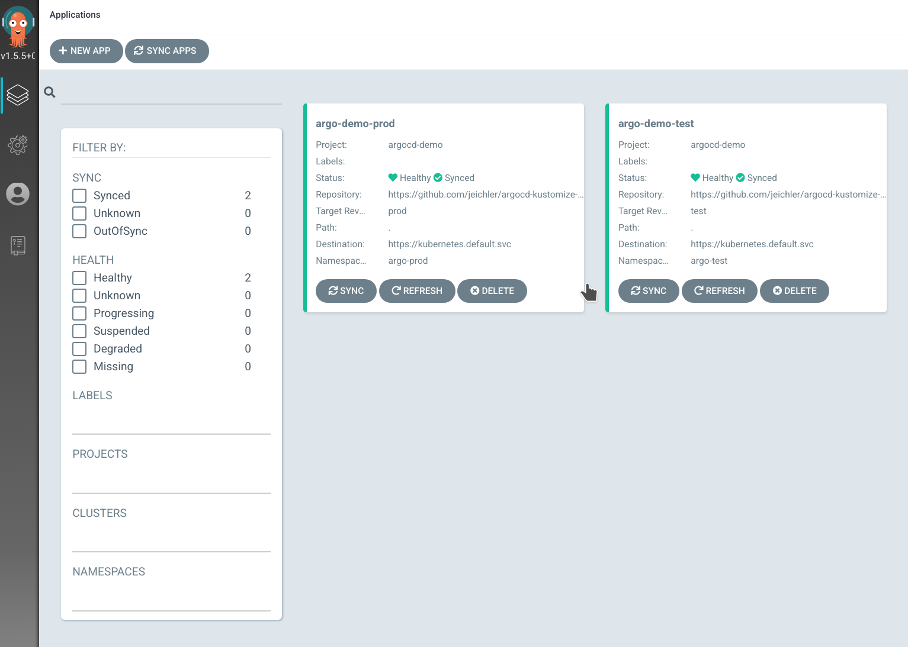
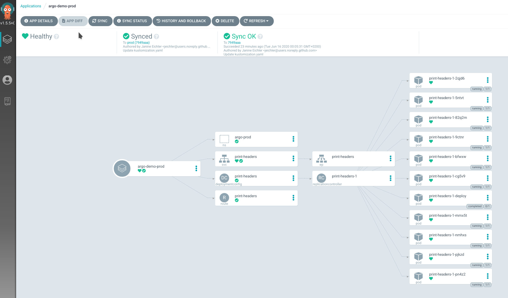
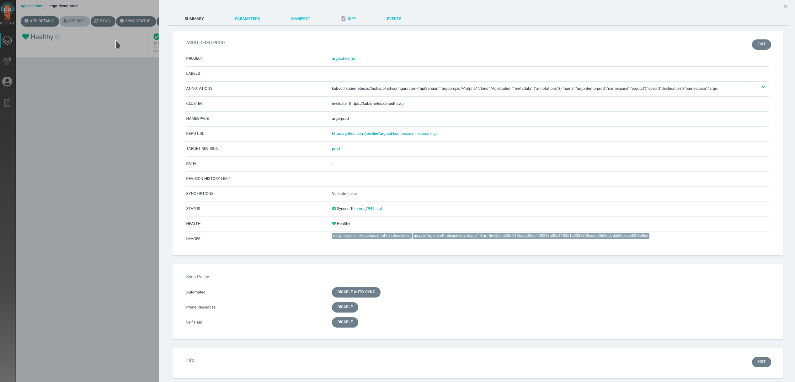

= Installation

== GitOps - Why?

in a shortened version of a nutshell version:

* configs from git, and git only
* config drift detection / notification / sync / auto-sync
* templating & overriding
* etc. 

Good read: https://www.openshift.com/blog/introduction-to-gitops-with-openshift

== ArgoCD - What is it?

Declarative GitOps CD tool :-)

== Installation

The gist:

```
oc create -f deploy/
```

This will:

* create the project `argocd`
* deploy the ArgoCD operator in this project
* create a sample argocd deployment integrated with the OpenShift OAuth server

If you are not the kubeadmin right now, you could either:
a) quick and dirty add your user to the clusterrolebinding cluster-admins
b) create a new group, e.g. argo-admins, add your user to this group and then modify the file deploy/3_argocd.yaml to include this new group:
```
    policy: |
      g, system:cluster-admins, role:admin
      g, argo-admins, role:admin
```

Cluster admins will be admins, anyone else will just have read-only access.

== Operator

Manages the lifecycle of ArgoCD, the respective custom resources are:

```
NAME            SHORTNAMES         APIGROUP      NAMESPACED   KIND
applications    app,apps           argoproj.io   true         Application
appprojects     appproj,appprojs   argoproj.io   true         AppProject
argocdexports                      argoproj.io   true         ArgoCDExport
argocds                            argoproj.io   true         ArgoCD
```

* Application: group of resources defined by manifest
* AppProject: logical grouping of applications
* ArgoCD: describes our ArgoCD cluster
* ArgoCDExport: describes the export of an ArgoCD resource (name of ArgoCD, schedule, storage)

Links:

* ArgoCD: https://argocd-operator.readthedocs.io/en/latest/reference/argocd/
* ArgoCDExport: https://argocd-operator.readthedocs.io/en/latest/reference/argocdexport/
* AppProject: https://argoproj.github.io/argo-cd/operator-manual/declarative-setup/#projects
* Application: https://argoproj.github.io/argo-cd/operator-manual/declarative-setup/#applications


== What has been created

The respective resources have been created which implement the following architecture:

image::images/argocd_architecture.png[]

On top of that we deployed https://github.com/dexidp/dex[dex] server, since we configured the OpenShift oauth integration. Dex is an identity service which uses OIDC. The operator configured everything for us, we just had to define
```
  dex:
    image: quay.io/redhat-cop/dex 
    version: v2.22.0-openshift
    openShiftOAuth: true
```
in our custom resource. The power of operators :-)

So, apart from dex, a repository server has been deployed, which holds a local git cache of our applications. Generates and returns the manifests based on repo url,. revision, application path, templating bits like helm values, kustomize, ...

There's also a "server" deployed, API and UI for ArgoCD, and the application controller which is just that: a K8s controller that monitos our applications agains the desired state (in git) and, if you may wish and configure, reconciles (to resolve the config drift for instance).

Links: https://argoproj.github.io/argo-cd/operator-manual/architecture


= Example Application

== Intro

We now have ArgoCD running, we can login via OpenShift oauth. Time to see it in action.
The following example is based on a very simple application to provide an overview how ArgoCD works. Don't be fooled though - with ArgoCD you could do so much more. Manage multiple clusters, with customizations for different stages (dev, test, prod), integrate with tools for secret management. It is highly customizable, you could even provide your own config management plugin instead of sticking with the out of the box ones (Helm, Kustomize, Ksonnet). But let's keep it simple for now and just deploy one application, in two different namespaces to simulate different stages and let's use kustomize in order to address stage-specific configurations. In our case, for production we want 10 pods instead of just one.

== Preparation

1. Fork the repo https://github.com/jeichler/argocd-kustomize-minisample
2. adjust the file `app/1_aplication.yaml` to point to your repo

=== Optional: Webhook
Create a webhook for your argocd (https://argoproj.github.io/argo-cd/operator-manual/webhook/) - in this example we dont to keep it as portable as possible so we fall back to the default ArgoCD sync which happens every 3 minutes.

== The app and kustomize

In the repository we will find 3 branches: master, test, prod. Forgive the lazy me, master should be called something more descriptive, we use it as baseline for our configuration of the application.

Let's check the files. We see some usual suspects like:

* deployment config
* service
* route

In addition we see a kustomization.yaml file, which basically just says: my resources are the three files above.

So, now move on to the test branch. the kustomization file looks like this:

```
bases:
- github.com/jeichler/argocd-kustomize-minisample?ref=master
- namespace.yaml
```

This will instruct customize to pick up the kustomization file from the master branch _and_ it will include the namespace.yaml.
The lazy author apparently gave enough permissions to the service account for the argocd controller to also be able to create namespaces :)

In prod, we anticipate a bit more traffic to our awesome app (quarkus.io[quarkus!]) and therefore want to have 10 pods of it.
sot he kustomization file looks a tiny bit different here:

```
bases:
- github.com/jeichler/argocd-kustomize-minisample?ref=master
- namespace.yaml

patchesStrategicMerge:
- replica_count.yaml
```

We just specify: use the strategic merge patch strategy for something defined in replica_count.yaml. Instead of having to bother with an oc patch command (we all hate it, right?), it's really easy peasy:

```
apiVersion: apps.openshift.io/v1
kind: DeploymentConfig
metadata:
  name: print-headers
spec:
  replicas: 10
```

That's all - really.

we now have in our git repo everything in place to let ArgoCD handle everything else.

== ArgoCD - Configure your Application

in short: `oc apply -f app/`

With this we create:

* an ArgoCD `AppProject` where we could configure a allowed soruce repos, destinatins and roles for more fine-grained control. In this tiny 101 however we want to keep it simple: we dont limit anything.
* two ArgoCD `Applications`: this is where we configure ArgoCD to sync against a specific repo, with a specific revision (test and prod branch for the two `Application`s). We also define sync policies. In this case more rigid: we prune, which means: everyhting which is not in the git repo, will be removed. You'll see that if you create e.g. another route, it will be removed automatically. So we not only are able to automatically detect the drift, it's also going to be corrected.

Now, if you open up ArgoCD and login, you will see our two `Application`s:



This just gives you an overview about the status of your apps. In our case, all seems to be perfectly fine.
Let's drill down into the argo-prod application. It should show us a namespace, a route, a service, a deploymentconfig and the 10 pods:



Looks good. If you, for instance, create an additional route, ArgoCD would detect the drift and report it as out of sync. Since we configured pruning, chances are that you might not even realize it. Disable auto-sync in case you want to test it.

Last but not least, you could check the `Application` details (remember, we set this up using a CustomResource, ideally this is all in git as well!):



== What now?

You can check features like rollbacks. Or you could start using ArgoCD for your applications or cluster configurations even. The docs are well maintained.
It's worthwhile to mention, that ArgoCD is a CNCF project: https://landscape.cncf.io/selected=argo. FLux CD and ArgoCD pan to join their GitOps forces, as both are Kubernetes-native GitOps apps, enforcing GitOps best practices. So watch out for updates!